# Ennoble

Ennoble is an open-source, offline-first brain-training app built with Laravel 13, NativePHP Mobile v4, SuperNative, EDGE components, and on-device SQLite. Its interface renders as native SwiftUI on iOS and Jetpack Compose on Android; core training, profiles, progress, settings, and game content work without a network connection.

## Preview

### Screenshots

#### Dark mode

| Home | Games | Quick Math |
| --- | --- | --- |
| 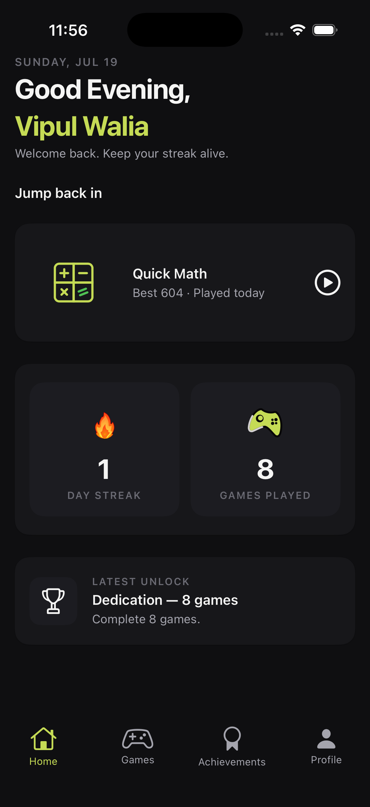 | 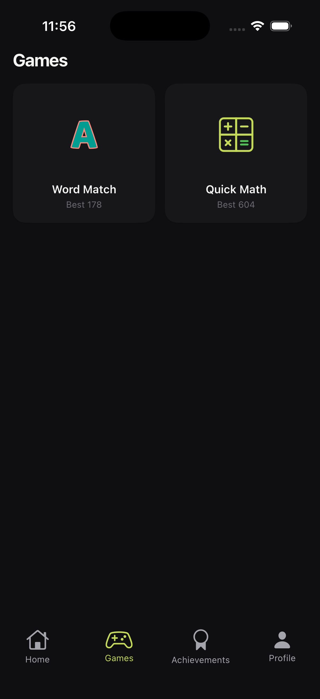 | 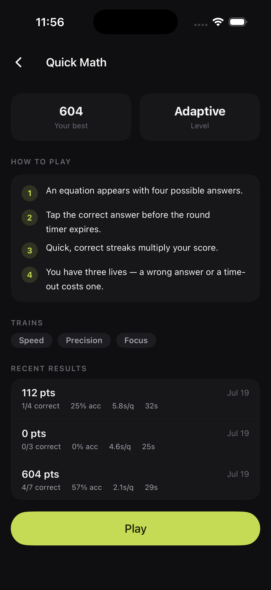 |

| Achievements | Profile | Settings |
| --- | --- | --- |
| 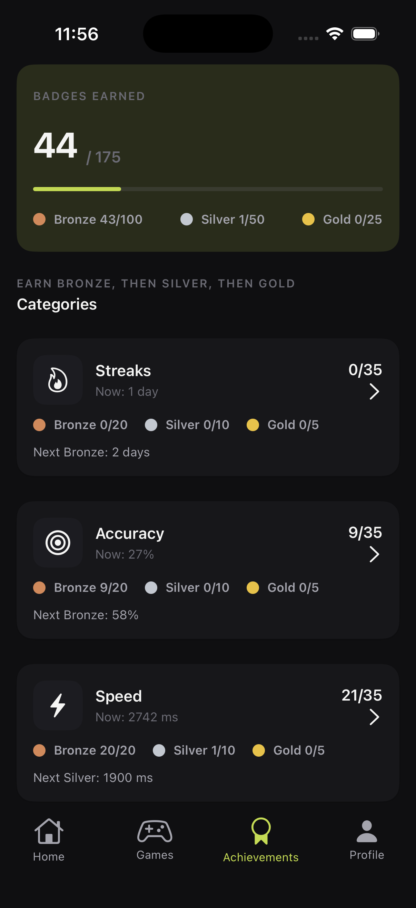 | 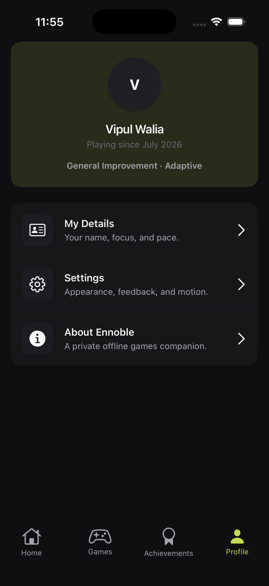 | 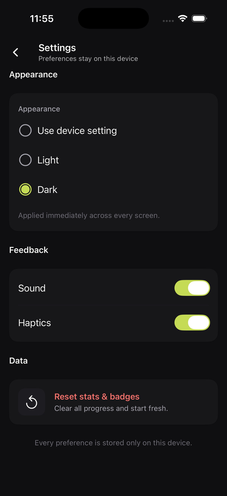 |

#### Light mode

| Home | Games | Quick Math |
| --- | --- | --- |
| 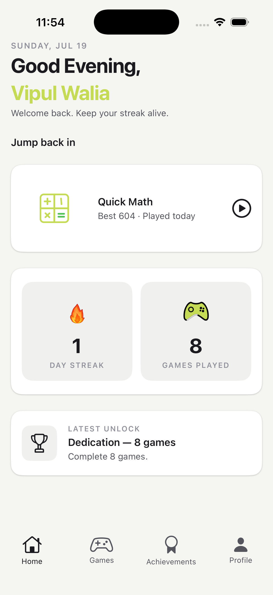 | 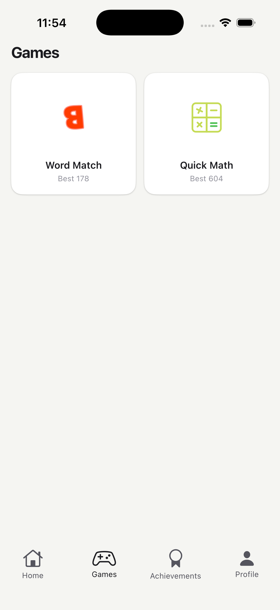 | 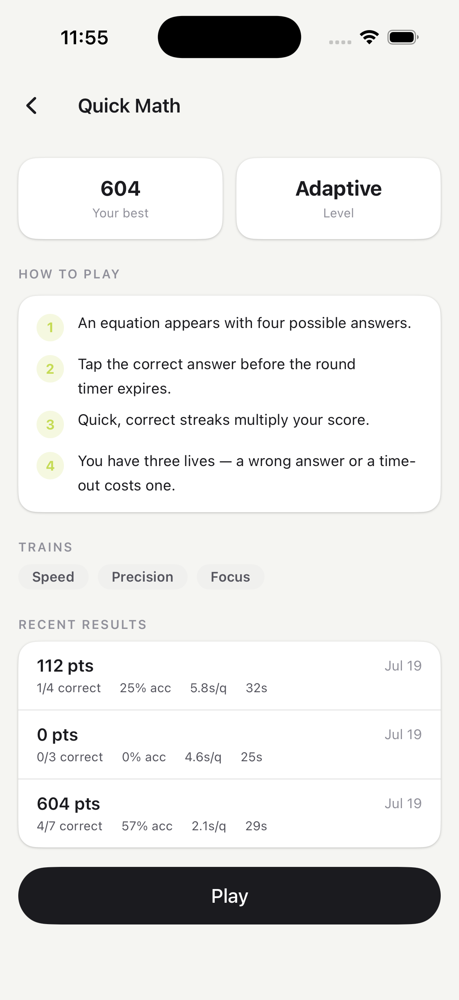 |

| Achievements | Profile | Settings |
| --- | --- | --- |
| 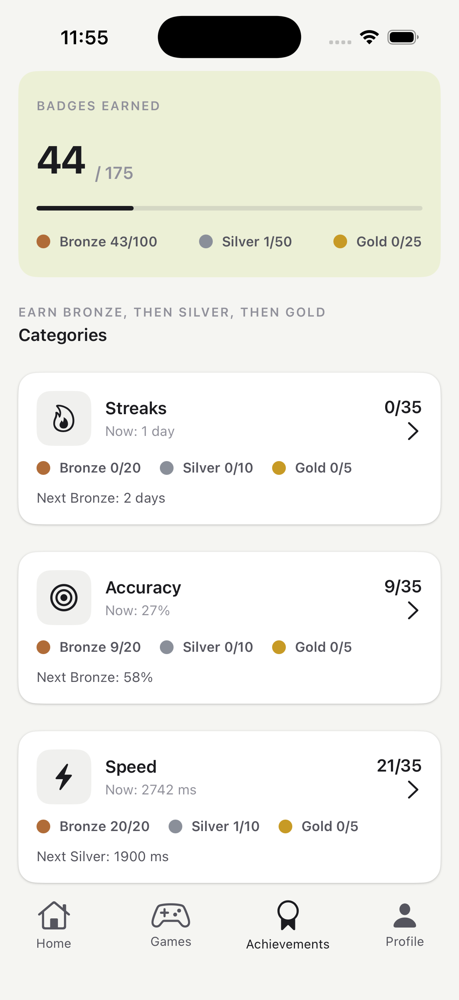 | 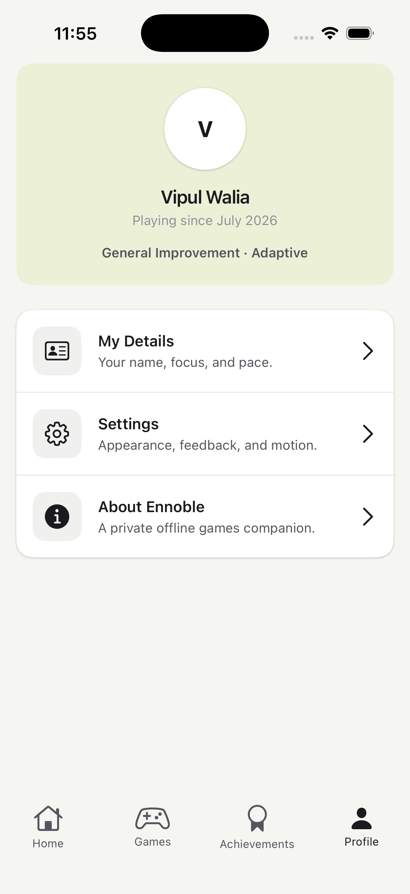 | 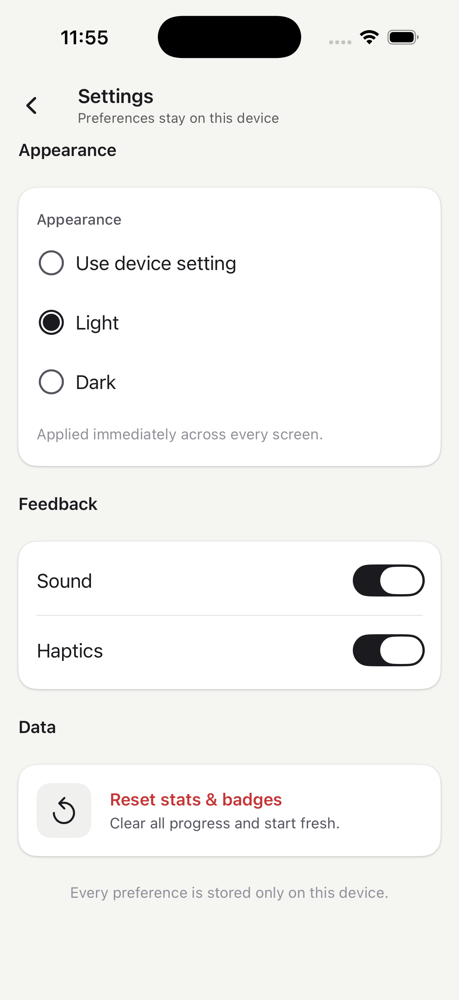 |

### iOS video

<a href="docs/media/video/ennoble-ios-demo.mp4"></a>

The walkthrough starts on Home, opens Games, plays Quick Math with both a correct and an incorrect answer, completes the session, visits Achievements and Profile, switches from Dark to Light appearance, and finishes back on Home.

[Watch the complete iOS walkthrough (1:47, MP4, 10 MB)](docs/media/video/ennoble-ios-demo.mp4)

## Highlights

- Fully native iOS and Android interface from one Laravel codebase.
- Offline-first SQLite persistence with no account or remote API requirement.
- Three offline training games — Word Match (vocabulary), Quick Math (arithmetic), and Recall (memory sequence) — with adaptive difficulty and their own accent colours.
- Local progress, achievements, streaks, profile, System/Light/Dark appearance, sound, haptics, and reduced-motion preferences.
- Native accessibility labels, scalable system text, light/dark appearance, and reduced-motion support.

## Local setup

### Requirements

- PHP 8.4 and Composer 2
- The PHP SQLite extension
- macOS with Xcode for iOS development
- Android Studio and Android SDK 36 for Android development
- A simulator, emulator, or development-enabled physical device

NativePHP does not support WSL. Windows and Linux can build Android; building iOS requires macOS and Xcode.

### 1. Clone and install

```bash
git clone https://github.com/vipertecpro/ennoble.git
cd ennoble

composer install
cp .env.example .env
php artisan key:generate

touch database/database.sqlite
php artisan migrate --no-interaction
```

On Windows PowerShell, use `Copy-Item .env.example .env` and `New-Item database/database.sqlite -ItemType File -Force` in place of `cp` and `touch`.

Ennoble is fully native and currently has no `package.json`, so there is no npm/Vite installation step.

### 2. Configure NativePHP

Set a unique local application ID in `.env` before installing the native shell:

```dotenv
NATIVEPHP_APP_ID=com.yourname.ennoble
NATIVEPHP_APP_VERSION=DEBUG
NATIVEPHP_APP_VERSION_CODE=1
```

For a physical iOS device, also provide the Apple Developer Team ID:

```dotenv
NATIVEPHP_DEVELOPMENT_TEAM=YOUR_TEAM_ID
```

Install both platform shells:

```bash
php artisan native:install both
php artisan native:plugin:list
```

All four bundled plugins—Lottie, Media Player, Vibe, and Native UI—should appear as registered.

### 3. Run the app

Choose the platform you have configured and run the matching command in your terminal:

```bash
# iOS
php artisan native:run ios --watch

# Android
php artisan native:run android --watch
```

Native screens hot-reload without Vite. Migrations run automatically inside the app when it starts.

### 4. Verify the checkout

```bash
composer validate --strict
php artisan test --compact
php artisan native:plugin:list
```

If you change PHP files, format them before opening a pull request:

```bash
vendor/bin/pint --dirty --format agent
```

## Development

Application development guidance for AI assistants lives in [AGENTS.md](AGENTS.md).

## Design, graphics, and credits

Ennoble's original visual language uses calm dark surfaces, a focused lime accent, native typography, and motion that communicates state. In-app graphics are composed from native platform symbols and shapes so they remain crisp, accessible, and fully offline:

- [Material Symbols](https://fonts.google.com/icons) for Android, licensed under Apache License 2.0
- [SF Symbols](https://developer.apple.com/sf-symbols/) for Apple-platform interfaces

The following products and design studies informed interaction research only; Ennoble does not reproduce their assets, branding, copy, or exact layouts:

- [Elevate motion and interaction catalogue](https://60fps.design/apps/elevate)
- [Elevate overview](https://www.makeuseof.com/elevate-brain-training-overview/)
- [Elevate design critique](https://ixd.prattsi.org/2023/02/design-critique-elevate-ios-app/)

## NativePHP Mobile v4 status

Ennoble currently uses NativePHP Mobile v4 pre-release branches. The required NativePHP Mobile branch and Native UI package line are temporarily incompatible through Composer, so the repository includes a narrowly scoped mirror at `packages/nativephp/native-ui`.

This is a transparent compatibility layer, not an application fork. Product code stays outside the mirror, and the mirror will be removed when mutually compatible official packages are available.
