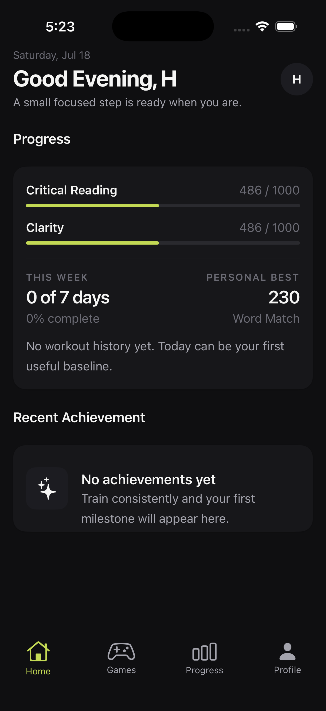
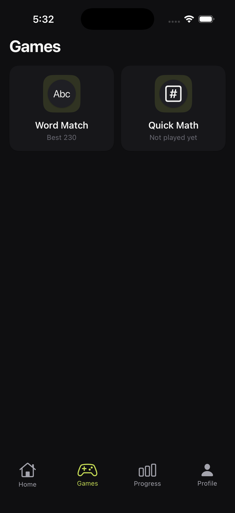
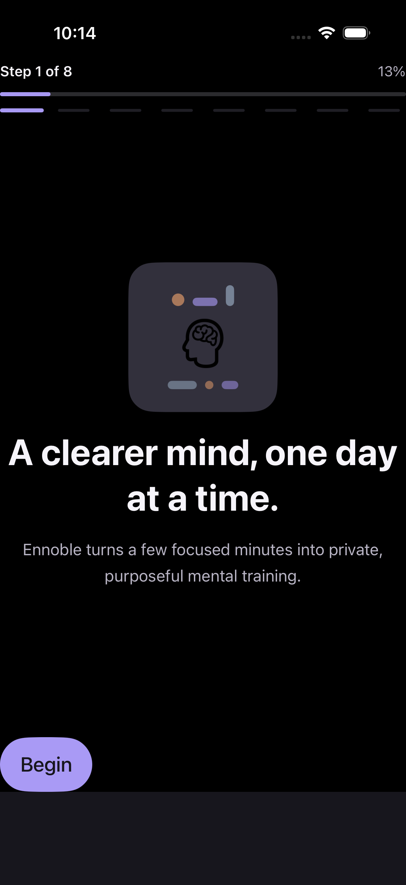
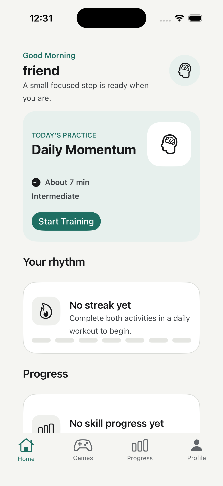
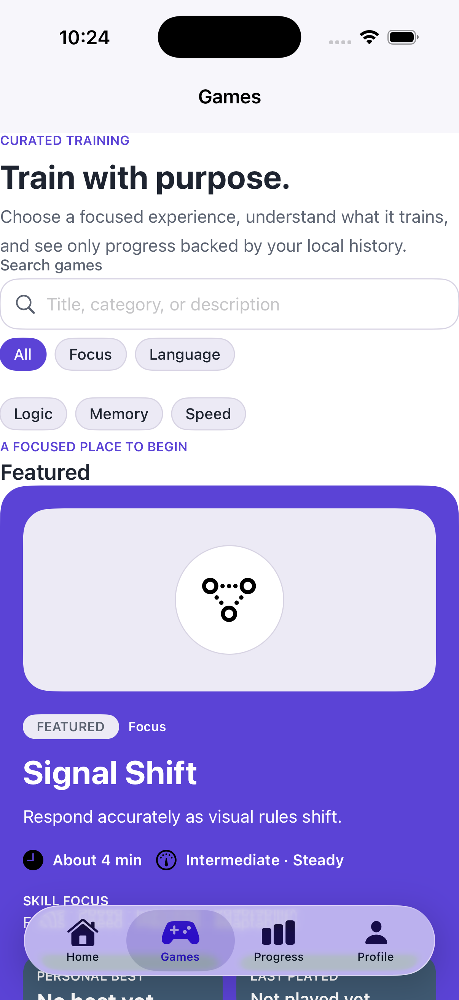
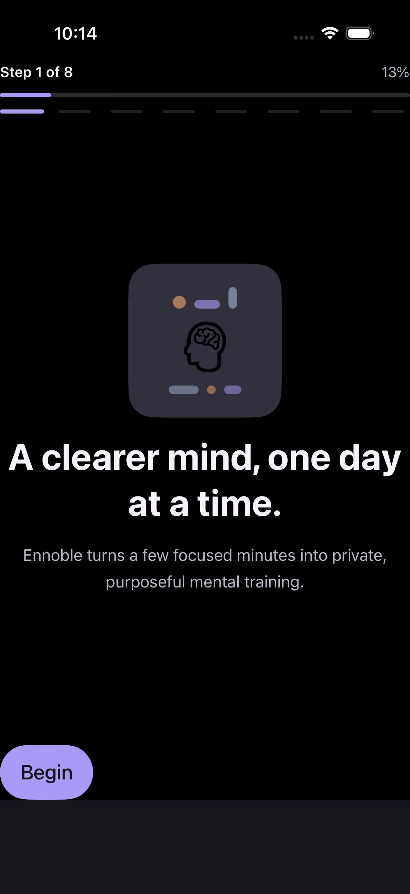
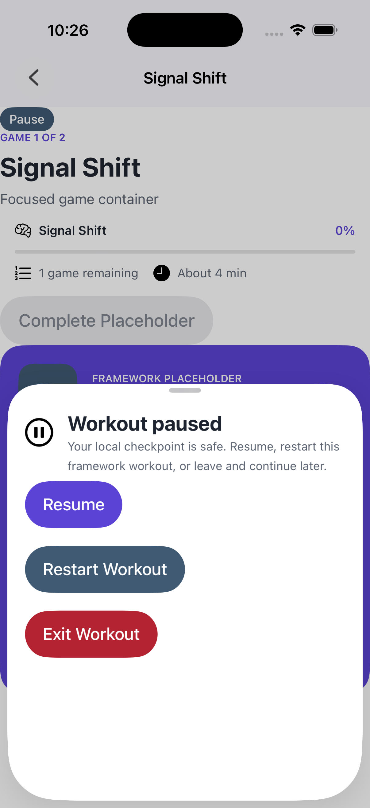
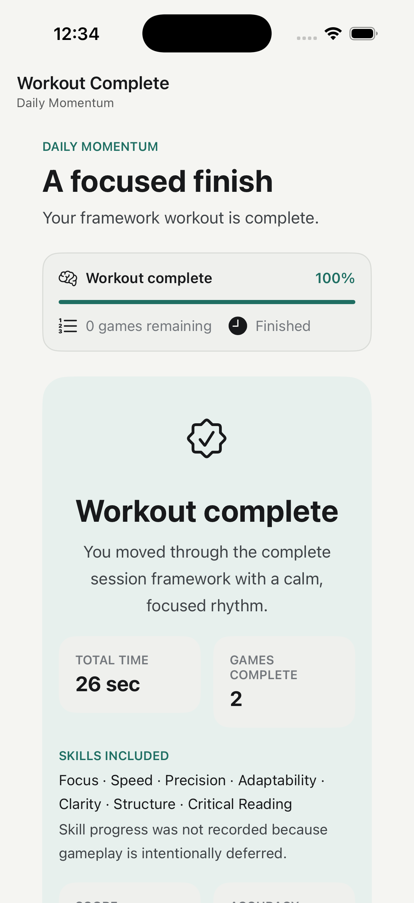

# Ennoble

Ennoble is an open-source, offline-first native brain-training application built with Laravel, NativePHP Mobile v4, SuperNative, EDGE components, and local SQLite.

Application development guidance lives in [AGENTS.md](AGENTS.md). Contributors should begin with [docs/CONTRIBUTING.md](docs/CONTRIBUTING.md).

## Screenshots

  
  &nbsp;&nbsp;&nbsp;
  

<b>Home</b> — greeting, progress, recent achievement &nbsp;·&nbsp; <b>Games</b> — offline game tiles (tap to open a game's details)

Captured on an iPhone 17 simulator (iOS 26.5).

## Design, Graphics & Credits

Ennoble's visual language ("Cortex") is calm zinc surfaces with a single lime
accent, native SF Pro typography, and motion that earns its place — modelled on
the feel of Elevate — Brain Training.

### Iconography & graphics

Because the app is fully offline and the native UI renders no bundled
raster/SVG images (iOS `AsyncImage` is URL-only; there is no image-bundling
pipeline, `<svg>`, `<canvas>`, or Lottie element), all in-app graphics are drawn
from platform vector symbol sets and native shapes, which render and animate
natively:

- **Material Symbols** (Android icons) — Apache License 2.0 — https://fonts.google.com/icons
- **SF Symbols** (iOS icons) — Apple, licensed for use in app interfaces on Apple platforms — https://developer.apple.com/sf-symbols/

Game glyphs, illustrations, and the water-glass round timer are composed from
these symbols plus native shapes and declarative animation (scale / translate /
opacity), rather than external image files. All symbol sets above are free to
use under the licenses linked.

### Design inspiration (Elevate)

Ennoble follows the interaction and motion language of Elevate. These references
informed the game flow, feedback micro-interactions, and screen layouts — used
for study only; no assets are reproduced:

- Elevate motion/interaction catalogue — https://60fps.design/apps/elevate
- Elevate overview — https://www.makeuseof.com/elevate-brain-training-overview/
- Design critique (Pratt IXD) — https://ixd.prattsi.org/2023/02/design-critique-elevate-ios-app/
- Building an app like Elevate — https://ideausher.com/blog/brain-training-app-like-elevate/
- Elevate brand deck — https://www.slideshare.net/slideshow/elevate-brain-training/53540958
- Interface reference board — https://in.pinterest.com/ideas/elevate-brain-training-app-interface/918386740461/

## NativePHP Mobile v4 Status

Ennoble currently targets NativePHP Mobile v4 Beta and intentionally uses official NativePHP packages.

The required NativePHP Mobile development branch and the later Native UI package line are temporarily incompatible through Composer. To keep the dependency baseline reproducible without editing installed dependencies or downgrading NativePHP Mobile, the repository contains a narrowly scoped mirror at `packages/nativephp/native-ui`.

This is a transparent compatibility decision, not an application fork. Ennoble product code must remain outside the mirror. The mirror will be removed when NativePHP publishes compatible official core and Native UI packages.

See [docs/UPSTREAM_TRACKING.md](docs/UPSTREAM_TRACKING.md) for the pinned branches, commits, exact differences, and permanent upgrade checklist.

## iOS UI Foundation

The offline onboarding, Home, Games, and pre-Signal Shift placeholder workout foundation was exercised on an iPhone 17 Pro simulator running iOS 26.5. Signal Shift now has a production native implementation, but its Prompt 8 device play-through is still outstanding. The full QA record and remaining NativePHP limitations are documented in [docs/IMPLEMENTATION_STATUS.md](docs/IMPLEMENTATION_STATUS.md).

| Onboarding | Home | Games |
| --- | --- | --- |
|  |  |  |

| Dark theme | Workout pause | Workout complete |
| --- | --- | --- |
|  |  |  |
